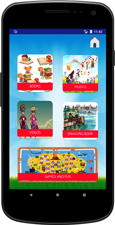
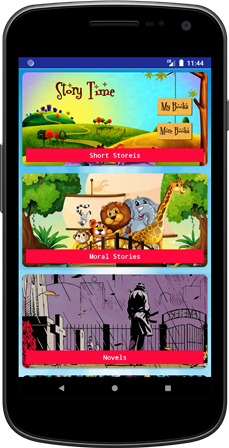
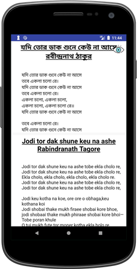
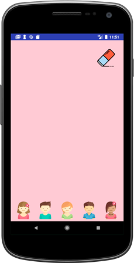
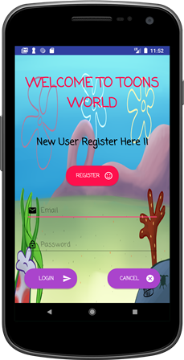
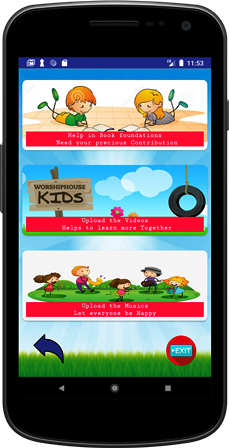
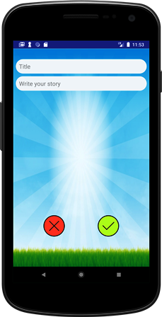

# Kids-Magazine
Kids Magazine is a android app for transliteration based childres e-magazine that tries to provide a platform for children to learn their mother tongue-Bengali by short stories and poems along with English translations.The app has different section for kids to learn and play with it like Books(Short stories, Moral stories, Novels, Science fiction), Music, Videos(Kids short stories clips), Drawing book to show case their creativity and Games and Fun sections.
User can also registered to it with Email and Password and can upload their own written stories, videos or musics.

